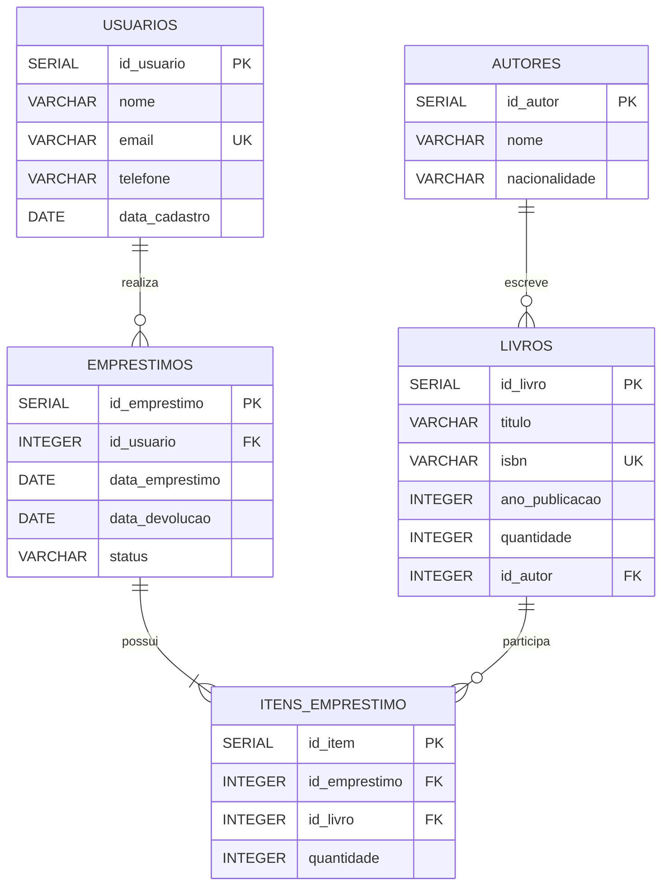

# Sistema de Biblioteca - PostgreSQL

## Informações do projeto

**Aluno:** Kerllon Matheus das Neves Amorim  
**Curso:** Ciência da Computação  
**Período:** 2º período  
**Turma:** G1-07  
**SGBD:** PostgreSQL  

## 1. Apresentação do projeto

O projeto consiste no desenvolvimento de um banco de dados relacional para um Sistema de Biblioteca, utilizando o PostgreSQL como Sistema Gerenciador de Banco de Dados (SGBD).

O sistema tem como objetivo organizar informações sobre autores, livros, usuários e empréstimos realizados pela biblioteca. O banco de dados permite registrar os livros disponíveis, seus respectivos autores, os usuários cadastrados e os empréstimos realizados.

A proposta é aplicar conceitos de modelagem e implementação de bancos de dados relacionais, utilizando chaves primárias, chaves estrangeiras, restrições de integridade e operações de manipulação de dados.

## 2. Objetivo geral

Desenvolver um banco de dados relacional para uma biblioteca, permitindo armazenar e organizar informações sobre livros, autores, usuários e empréstimos de forma estruturada e consistente.

## 3. Público-alvo

O sistema é destinado principalmente a bibliotecas de pequeno e médio porte que necessitam controlar seu acervo e registrar os empréstimos realizados pelos usuários.

Também pode ser utilizado como projeto acadêmico para demonstrar conceitos fundamentais de bancos de dados relacionais e PostgreSQL.

## 4. Modelo de dados

O banco de dados é composto pelas seguintes entidades:

- **Autores:** armazena os dados dos autores dos livros.
- **Livros:** armazena informações sobre os livros disponíveis na biblioteca.
- **Usuários:** armazena os dados das pessoas cadastradas na biblioteca.
- **Empréstimos:** registra os empréstimos realizados pelos usuários.
- **Itens do empréstimo:** relaciona os empréstimos aos livros emprestados.

### Diagrama do modelo relacional



## 5. Regras do banco de dados

O banco possui regras para garantir a integridade dos dados:

- Cada autor possui um identificador único.
- Cada livro possui um identificador único.
- O ISBN de cada livro não pode ser repetido.
- Cada usuário possui um identificador único.
- O e-mail de cada usuário não pode ser repetido.
- Um livro deve estar relacionado a um autor.
- Um empréstimo deve estar relacionado a um usuário.
- Cada item de empréstimo deve estar relacionado a um empréstimo e a um livro.
- A quantidade de livros deve ser maior que zero.
- O ano de publicação não pode ser negativo.
- O status do empréstimo deve possuir um valor válido.

## 6. Implementação

A implementação foi realizada utilizando o PostgreSQL.

Os scripts SQL estão organizados na pasta `scripts/` de acordo com as ações realizadas durante o desenvolvimento.

### Organização dos scripts

**Versão 1 - Criação das tabelas**

- `v1_create_table_autores.sql`
- `v1_create_table_livros.sql`
- `v1_create_table_usuarios.sql`
- `v1_create_table_emprestimos.sql`
- `v1_create_table_itens_emprestimo.sql`

**Versão 2 - Inserção de dados**

- `v2_insert_into_autores.sql`
- `v2_insert_into_livros.sql`
- `v2_insert_into_usuarios.sql`
- `v2_insert_into_emprestimos.sql`
- `v2_insert_into_itens_emprestimo.sql`

**Versão 3 - Alteração e exclusão**

- `v3_update_livros.sql`
- `v3_delete_usuarios.sql`

## 7. Execução

Os scripts devem ser executados no banco de dados PostgreSQL disponibilizado pela instituição.

Para este projeto, conforme a organização da turma, o banco utilizado é:

```text
Banco: db07
Usuário: aluno07
Grupo: G1-07
```

A execução deve seguir a ordem das versões:

1. Criação das tabelas;
2. Inserção dos dados;
3. Atualização dos dados;
4. Exclusão de dados de teste.

## 8. Tecnologias utilizadas

- PostgreSQL
- pgAdmin 4
- SQL
- GitHub
- Mermaid

## 9. Autor

**Kerllon Matheus das Neves Amorim**

Projeto acadêmico desenvolvido para a disciplina de Banco de Dados do curso de Ciência da Computação.